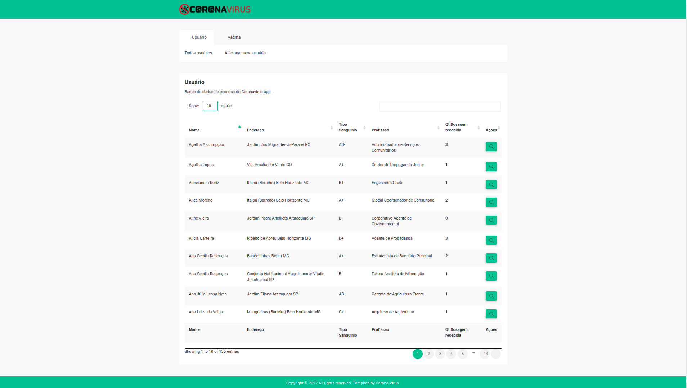
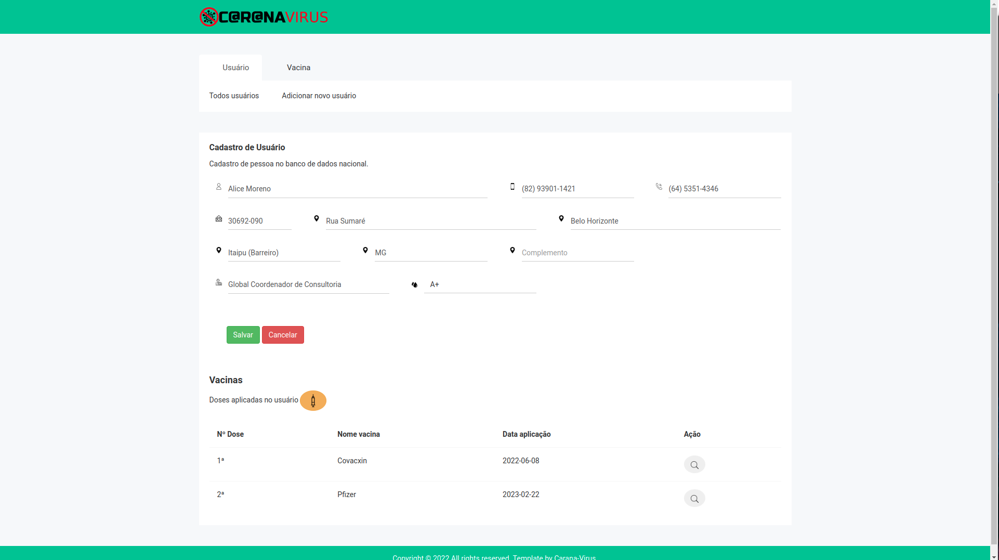
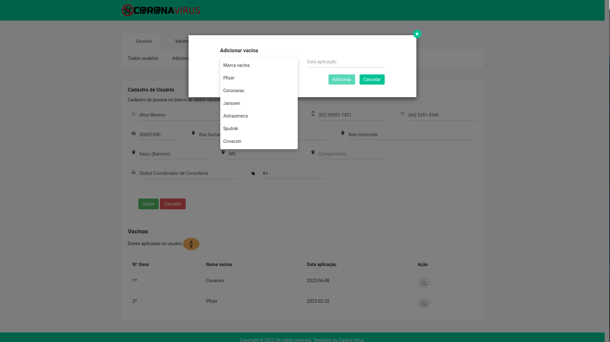
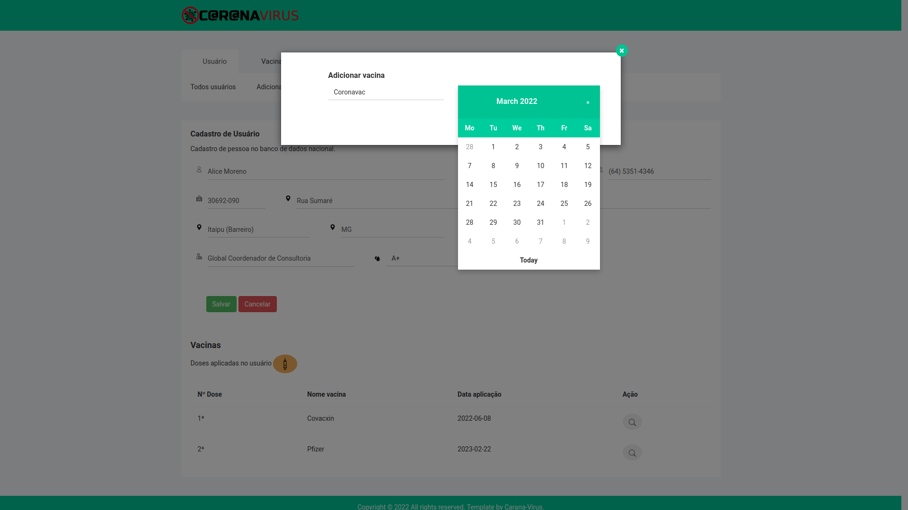
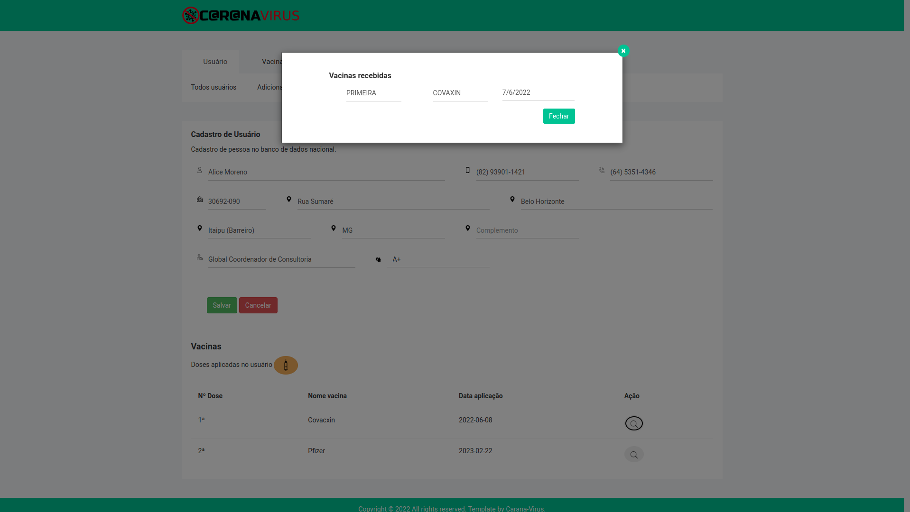
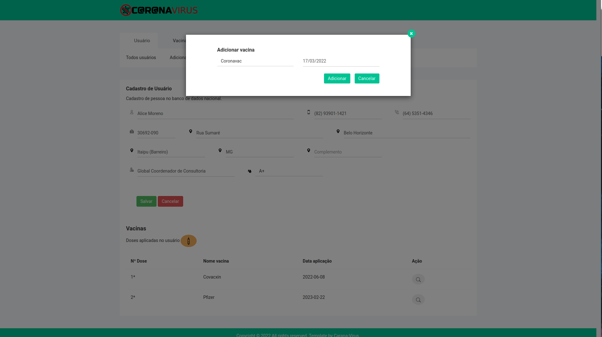
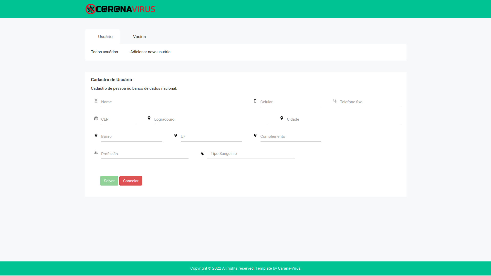
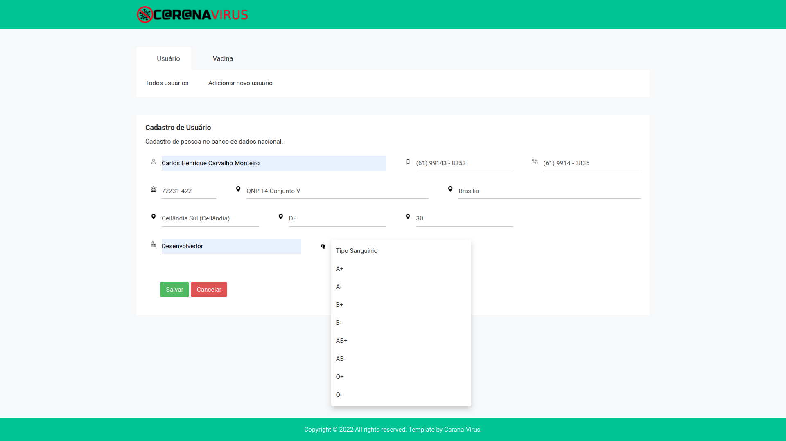
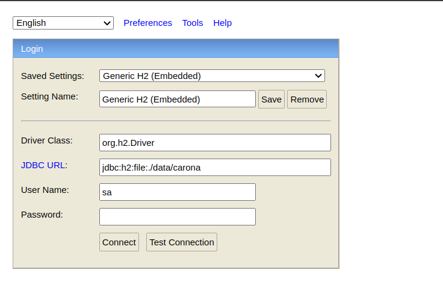
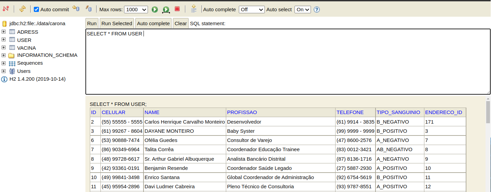

## Frameworks

* Para este projeto, foi escolhido o framework "Spring boot", pois possui todas as bibliotecas necessárias para desenvolver a aplicação de forma rápida e eficaz, visando a rapidez  nas configuração do projeto e ganhando tempo para o foco no desenvolvimento. 
* No front-end foi usado o thymeleaf que utiliza HTML, CSS e javascript. 
* O projeto conta com a arquitetura no padão MVC.
* Para os testes unitarios foi utilizado o JUNIT 5.

## Executando o projeto

* Para  executar o projeto, é necessário executar o arquivo "CaranaVirusApplication.java", como "Java application" ou executando o comando ./mvnw spring-boot:run

## Dependências

### dev-tools
Por trazer a facilidade do projeto fazer o re-buid toda vez que é salvo algum arquivo fonte, desta forma não necessita finalizar o processo e recomeçá-lo.

### thymeleaf
Para a criação das paginas web front-end, o projeto tem o foco em uma arquitetura MVC.

### h2database
Banco de dados gerada em uma pasta chamada "data" na raiz do projeto.
Para a carga inicial temos a classe de teste "CreateDataBD" que realiza uma carga com alguns dados que podem ser utilizados para fins de teste.

### projectlombok
Depêndencia usada para gerar contrutores e métodos gets e sets, visuando ganhar tempo no desenvolvimento do projeto.

### com.github.javafaker
Dependência utilizada com fim de gerar dados para criar volume no banco de dados nos testes.

### json
Dependencia usada a requisição para "viacep" com fim de obter um objeto json com o endereço do cep correspondente.

## Imagens das telas

Algumas imagens das telas do projeto.

### Todas pessoas
Após o projeto receber o build, é iniciado e encontrado a tela com todos os usuários pelo end-point: http://localhost:8080/

  

### Perfil de pessoa específica
Após clicar no botão referente a pessoa na tela de todas pessoas, é carregado a tela de profile da pessoa que pode ser encontrada pelo end-point: http://localhost:8080/profile?id=<numero-id-pessoa>

  

	Adicionando marca da nova vacina que a pessoa está recebendo.
  

	Adicionando data da nova vacina que a pessoa está recebendo.
  

	Adicionando nova vacina que a pessoa está recebendo.
  

	A vacina que já foi recebida pode ser verificada pelo lupa, na lista de vacinas a baixo do cadastro da pessoa recebendo.
  

### Adicionando nova pessoa no sistema.
Após clicar em "Adicionar novo usuário", é carregado a tela de formulario para o cadastramento de uma nova pessoa, esta tela pode ser encontrada no end-point: http://http://localhost:8080/form-user

	Formulário de nova pessoa, que deve conter : Nome, Celular, Telefone, Endereço, Profissão e Tipo sanguinio. 
  

	Preenchimento da tela. 
  

### Banco em Memoria H2

Foi utilizado o banco de dados H2 para a fase de desenvolvimento.

Após o projeto receber o build, é iniciado o H2, que é encontrado através do endpoint: http://localhost:8080/h2-console/ dados de acesso:

* JDBC URL: jdbc:h2:file:./data/carona
* User: sa
* Password: vazio

	Tela de Login do banco

   

	Bando de Dados

  

## Algumas Regras de negócio aplicada no projeto

###Segunda dose
* Coronavac: 28 dias após a primeira dose
* Pfizer: oito semanas após a primeira dose
* AstraZeneca: 12 semanas após a primeira dose
* Sputinik: era recomendado um prazo de 21 dias após a primeira dose, agora deve ser aplicada apos 3 meses apos a aplicação da primeira dose
* Covaxin: A segunda dose deve ser aplicada 28 dias após a primeira. *Suspensa temporariamente*

###Dose de reforço
* Janssen: dois meses após a primeira dose
* Coronavac: quatro meses após a segunda dose
* Pfizer: quatro meses após a segunda dose
* AstraZeneca: quatro meses após a segunda dose

### Dose suspensa
* COVAXIN : está suspensa e não é permitida a utilização por enquanto

### fontes 
* https://www.joinville.sc.gov.br/noticias/qual-o-intervalo-entre-as-doses-das-vacinas-contra-a-covid-19/
* https://oglobo.globo.com/saude/intervalo-entre-doses-da-sputnik-pode-ser-estendido-ate-tres-meses-diz-fabricante-24987647
* https://www.gov.br/anvisa/pt-br/assuntos/paf/coronavirus/vacinas/covaxin#:~:text=Quantidade%20de%20doses%20para%20imuniza%C3%A7%C3%A3o,18%20anos%20e%20%3C%2060%20anos.

